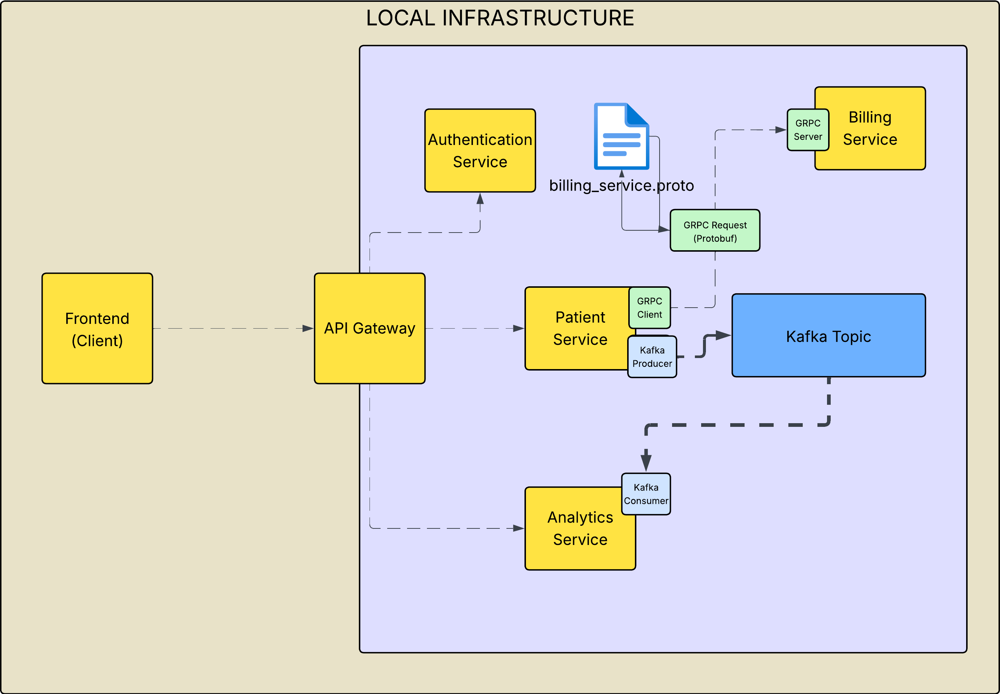

# Patient Management System
## A Production-Ready Microservice Architecture Backend

### Spring Boot Architecture (e.g. Patient Service)

### Local Infrastructure

### Deployment Infrastructure

### Tech Stack Used:
- Java
- Spring 
  - Boot
  - Cloud
  - Security
  - API Gateway
- Kafka
- PostgreSQL
- LocalStack (Simulated AWS Environment)
- Jpa
- JWT
- Protobuf
- gRPC
- Rest Assured
- JUnit

## Features
### Patient Service
A simple CRUD backend interface, allowing for frontend clients to:
- Get a list of patients
- Create a new patient
- Update an existing patient via their ID
- Delete an existing patient via their ID

Possible ideas for Extension:
- Patient Lookup
- Patient Groups (e.g. Families)

### Billing Service
Receives (via gRPC) responds to a new patient being created and creates a new billing account.

Possible ideas for Extension:
- Full scale business logic for billing
- This project mainly focused on the entire app, so billing was just to learn gRPC

### Analytics and Notification Services
Using Kafka, these services were made to demonstrate asynchronous communication between services.
In this case, Analytics and Notification were KafkaConsumers, responding to actions made in the 
Patient Service, which was the KafkaProducer. These would send/receive communication
through a Kafka topic, which was instantiated as a container in Docker.

### API Gateway
To prevent each service being directly accessed in the web, an API Gateway was made 
to enhance overall security. From this, the only accessible port would be 4004, and then from 
this gateway, services would then communicate

### Auth Service
In order to control who may have had access/update patient records, an auth service was made to 
ensure that users had the right access permissions, and if so, authenticate that those permissions
were given by this server. This was done with the help of JWT as well as Spring Cloud and Spring Security.
By using Docker to store the secret key, this means that token validation cannot be bypassed externally and 
ensures tighter security on user access.

### Integration Tests
In order to assert the functionality of the authentication service, along with token validation, Integration Tests
were set up using JUnit and Rest Assured. These allowed for tests to be performed for both successful and unsuccessful
calls to auth/login and get-patients.

### LocalStack
While AWS may incur costs, this project uses LocalStack, which emulates the AWS environment.
While this project does not deploy directly to AWS, the code and implementation is fully compatible to 
deployment to AWS. Some features however are limited/no supported, e.g. IAMs and Security Roles. This is due to the
fact that LocalStack is only emulating AWS on one machine.
To further this, deployment will be implemented through IaC.